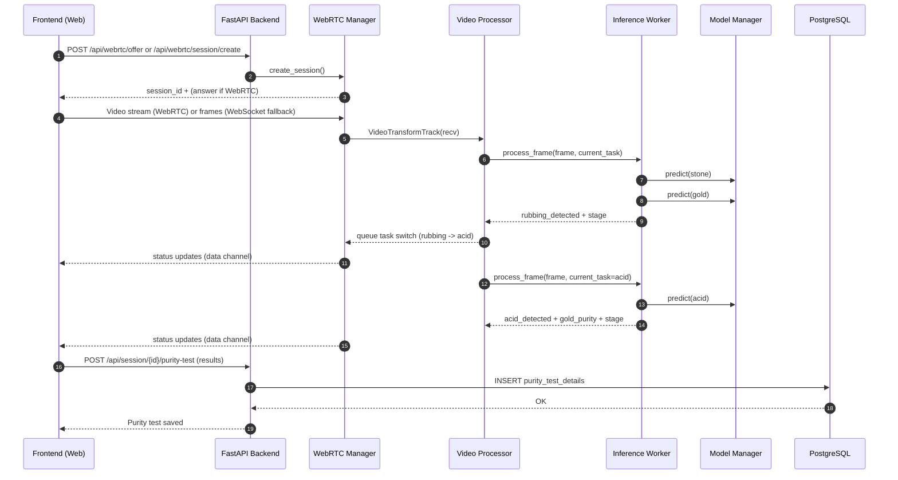
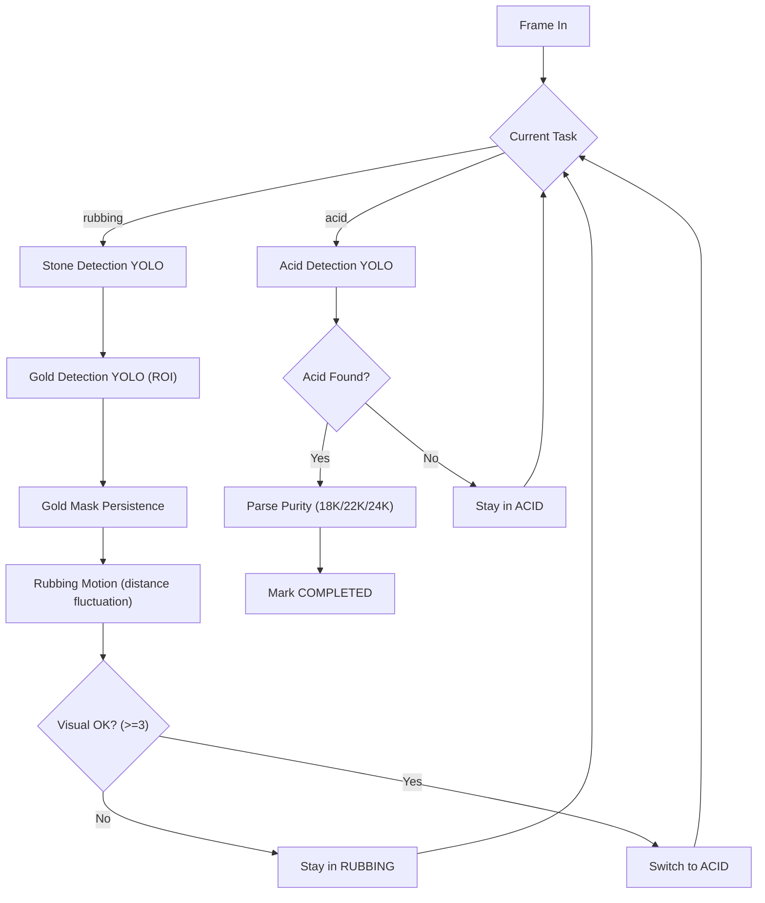
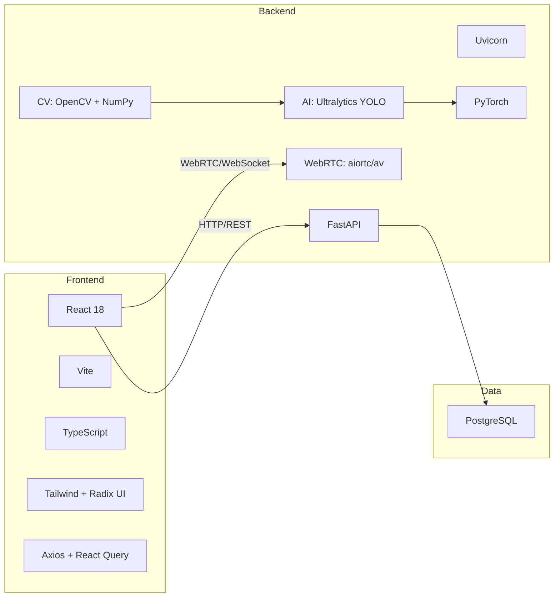
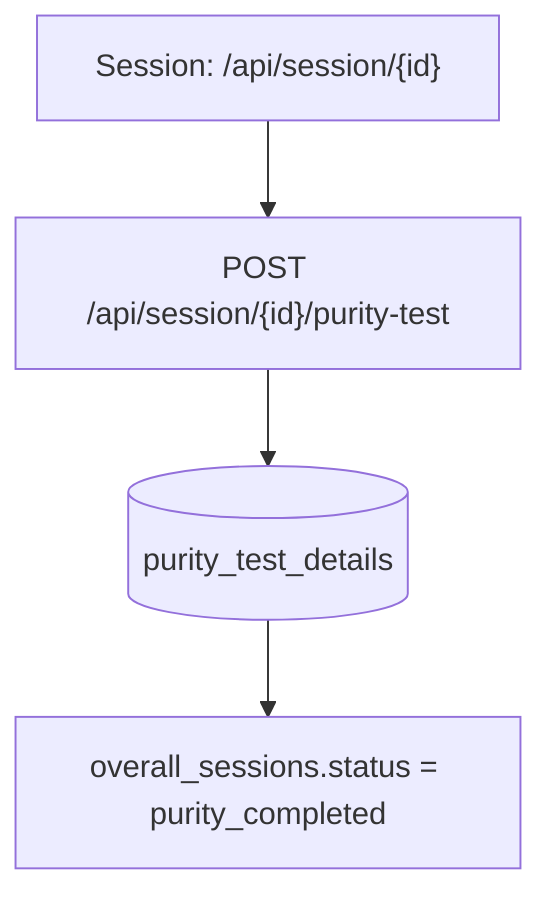

# Purity Testing Diagrams

These diagrams describe the purity testing workflow and the tech stack used in this project.

## Purity Testing Workflow (End-to-End)

## Inference Pipeline (Rubbing -> Acid)

## Tech Stack Overview

## Purity Data Persistence

